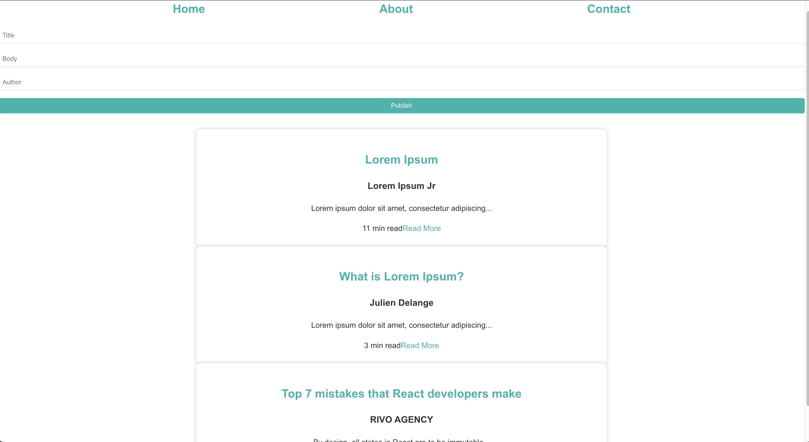
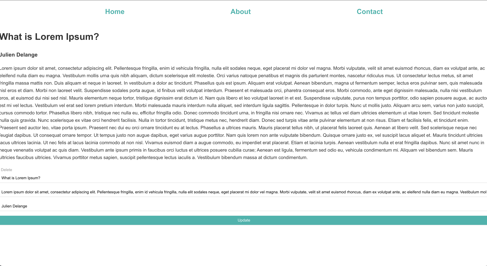
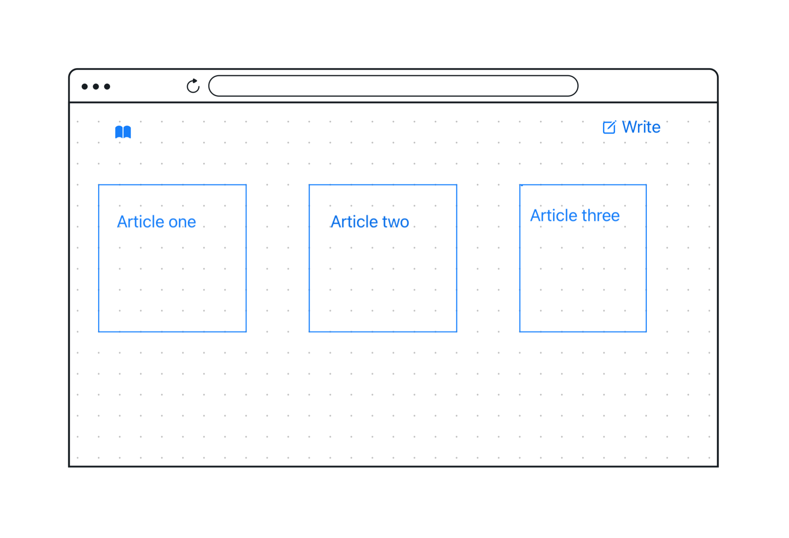

# Getting Started with Create React App

# Blogging-Platform

On this full-stack web application a user will have the ability of creating, deleting, and updating their articles on this platform. 

# Current

| Name | Data|
|-------|------ |
|Author| char |
|Title | char |
|body  | char |

# Technology Used
- Django
- Postgres
- React
- Node

# Planned 

# Live Link
[Live Link]()
# Backend Repository
[Backend](https://github.com/ErmiyasHailemichael/Backend-Blog)

# User Stories
[Tello](https://trello.com/b/mmmQjiW2/blog)

# Future Enhancements

Authentication, Rating, BookMark

